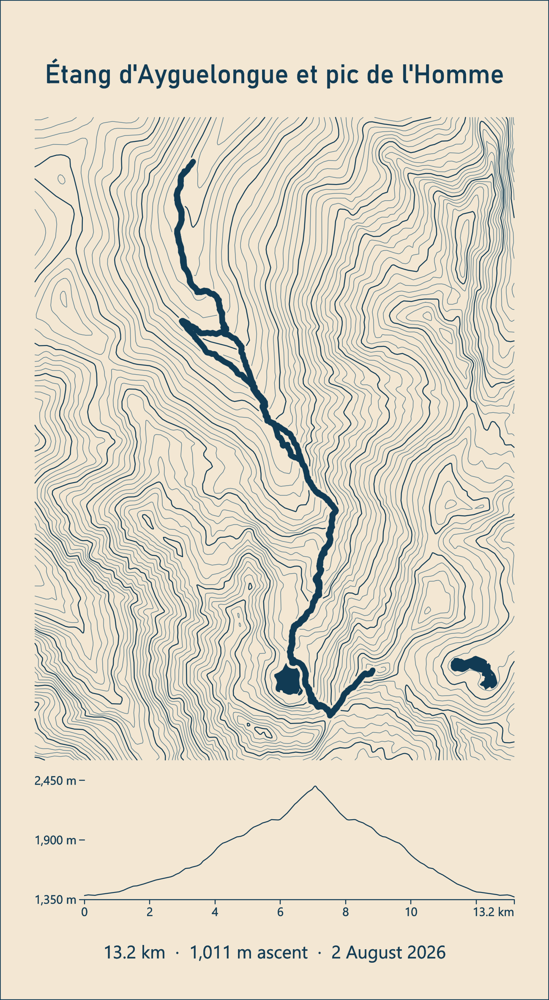
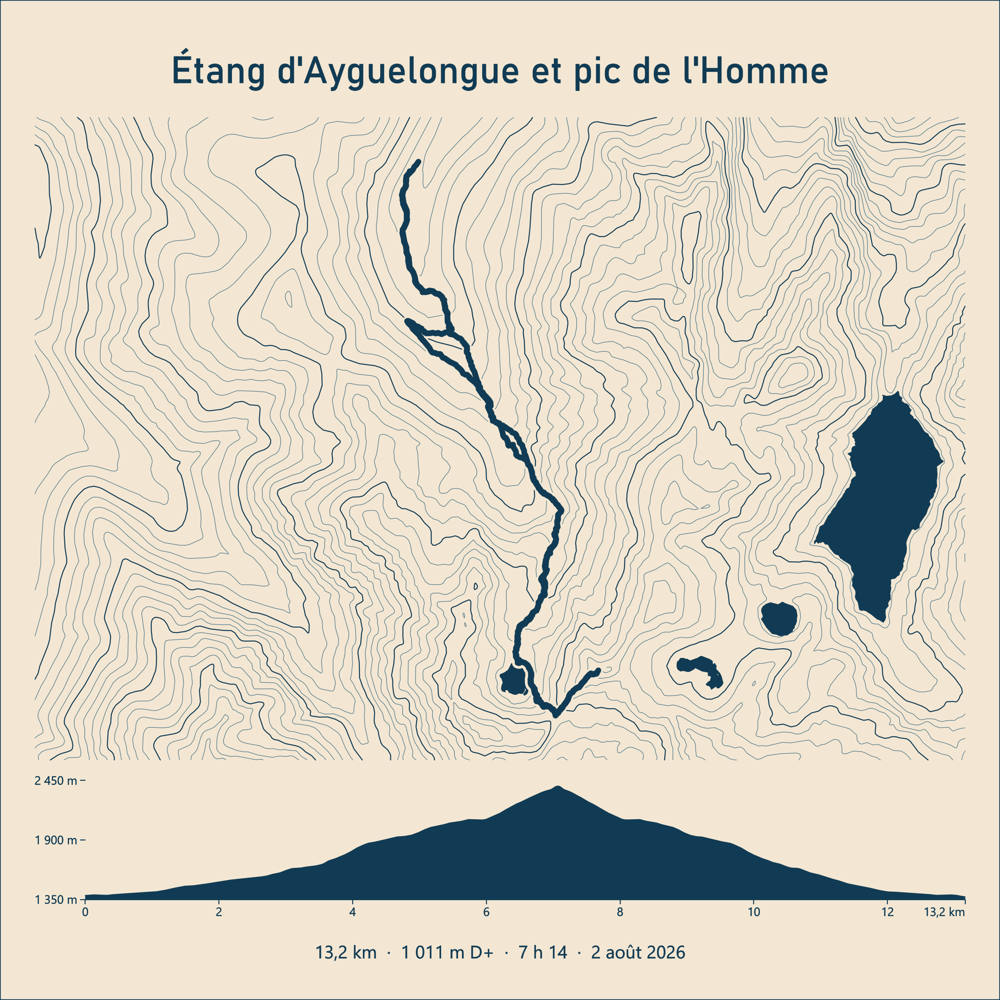
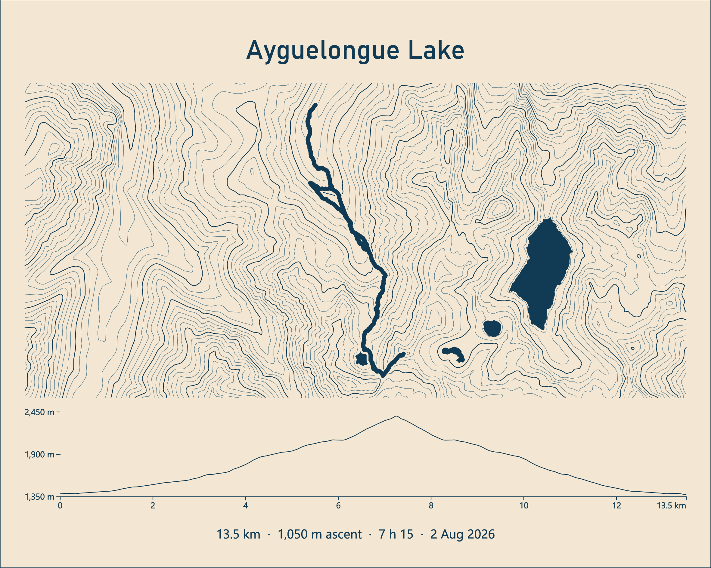

# gpx2engraving

Turn a GPX track into a **clean, laser-ready SVG** for LightBurn: a title, the track drawn over
contour lines, nearby lakes, the elevation profile, distance, elevation gain and date.
Everything is vector, text is converted to paths, units are millimetres, and every kind of element
sits in its own colour so LightBurn puts it on its own layer.

| Portrait (auto) | Square | Landscape |
|---|---|---|
|  |  |  |

The three plates above come from the same GPX file; only the options differ.
The PNG preview shows the plate as it will look once engraved; the SVG itself uses one colour per layer.

## What it does

1. Reads one or several GPX files (tracks or routes, several segments allowed), optionally smooths
   and despikes them, and projects everything to Lambert-93.
2. Computes distance, elevation gain (smoothed elevation plus a hysteresis threshold), date and duration.
3. Picks the plate shape (square, portrait or landscape) as tight as possible around the track, 20 cm max by default.
4. Downloads the IGN **RGE ALTI 5 m** digital elevation model over the extent (cached locally), smooths it
   and generates contour lines with an automatic interval.
5. Fetches water bodies from the IGN **BD TOPO** (or OpenStreetMap) as filled polygons.
6. Cleans everything for the laser: clips to the frame, simplifies paths, removes tiny fragments,
   keeps an empty halo around the track so it stands out from the contours.
7. Converts all text (title, statistics, labels) to paths: no font is needed on the laser side.
8. Writes an SVG in millimetres with one layer per colour, plus a PNG preview.

## Requirements

- **Windows with QGIS** (3.28 or newer). The script runs with the Python that ships with QGIS,
  which already provides GDAL, numpy, shapely, pyproj, scipy, matplotlib and fontTools. Nothing else to install.
- Internet access for the DEM and the lakes. Downloads are cached in `cache/`, so re-runs are offline.
- Coverage: **France** (IGN Géoplateforme open data, no API key).

### Without QGIS

Any Python 3.10 or newer works with these packages:

```bash
pip install numpy scipy shapely pyproj requests matplotlib fonttools
python gpx2engraving.py track.gpx --title "My hike"
```

On Windows, set `GPX2ENGRAVING_PYTHON` to that `python.exe` and the `.bat` launcher will use it.

## Installation

```bash
git clone https://github.com/YannickRiou/gpx2engraving.git
cd gpx2engraving
gpx2engraving.bat examples\ayguelongue.gpx --title "Étang d'Ayguelongue et pic de l'Homme"
```

The launcher looks for QGIS in `C:\Program Files\QGIS 3*` and `C:\OSGeo4W`. The first run downloads
about 2 MB of elevation data for a typical day hike and takes a few seconds.

## Usage

```bat
gpx2engraving.bat track.gpx --title "My hike"
```

This writes `track.svg` and `track_preview.png` next to the GPX file and prints a JSON summary
(plate size, scale, distance, ascent, elevations, lakes found, stages).
A `gpx/` folder is ignored by git: drop your personal tracks there.

Without `--title`, the track name stored in the GPX is used.

### Overriding the values

Everything engraved on the plate can be forced from the command line, which is handy when your
watch or app reports different numbers than the GPX:

```bat
gpx2engraving.bat track.gpx --title "Pic de Cagire" --distance 12.4 --ascent 1150 --date "14 July 2026" --duration "5 h 30"
```

`--distance` (km) also rescales the profile's distance axis so the labels stay consistent.

### Multi-day trips: merging several GPX files

Pass several files and they are merged into one plate. Files are sorted by start time
(`--keep-order` to keep the command-line order), distance and duration are summed stage by stage
without counting the gaps between them (nights, transfers), and the date becomes a range such as
"2–4 August 2026". `--stage-marks` draws a thin vertical line on the profile at each stage boundary.

```bat
gpx2engraving.bat day1.gpx day2.gpx day3.gpx --title "GR10, stage 3 to 5" --stage-marks
```

### Noisy tracks: smoothing and despiking

A cycling computer or a phone in a backpack produces a jittery track that engraves badly and
inflates the distance (often by 10 to 20 %). Two independent filters fix that:

- `--track-smooth SIGMA` resamples each segment every 2 m and applies a gaussian filter of
  `SIGMA` metres to the geometry. 5 to 10 m removes GPS jitter while keeping switchbacks;
  above 20 m the corners start to get cut.
- `--despike KMH` drops points that would require a speed above `KMH` km/h from the previous
  kept point, which removes isolated GPS jumps. 10 to 12 is a good value for hiking.

```bat
gpx2engraving.bat joclar.gpx --title "Étang de Joclar" --track-smooth 8 --despike 10
```

Distance and ascent are computed on the filtered track, so the displayed distance goes down when
the noise goes away. Use `--distance` to force the value from your watch if you prefer.

### More examples

```bat
:: Square plate, French text, duration shown, filled area under the profile
gpx2engraving.bat track.gpx -t "Pic de Cagire" --format square --lang fr --show-duration --profile-fill

:: Landscape, track as a thin centre line instead of a filled polygon, lakes from OpenStreetMap
gpx2engraving.bat track.gpx -t "Lac d'Oô" --format landscape --track-style line --water osm

:: Fixed 20 m contour interval, 15 cm plate, no date
gpx2engraving.bat track.gpx -t "Néouvielle" --interval 20 --max-size 150 --no-date

:: Batch: every GPX in a folder, title taken from each file
for %f in (C:\hikes\*.gpx) do gpx2engraving.bat "%f"
```

A sample track is provided in `examples/ayguelongue.gpx`.

### Main options

| Option | Default | Effect |
|---|---|---|
| `--title`, `-t` | GPX name | engraved title |
| `--out`, `-o` | next to the GPX | output SVG file |
| `--lang` | `en` | language of the engraved text (`en`, `fr`): date, decimal separator, "ascent" / "D+" |
| `--format` | `auto` | `auto`, `square`, `portrait`, `landscape` |
| `--max-size` | 200 | maximum plate side (mm) |
| `--margin` | 250 | minimum terrain margin around the track (m) |
| `--distance`, `--ascent`, `--date`, `--duration` | from GPX | force the displayed values |
| `--keep-order` / `--stage-marks` | off | merging: keep file order / mark stage boundaries on the profile |
| `--track-smooth` | 0 | gaussian smoothing of the track geometry, sigma in metres (5-10 for noisy GPS) |
| `--despike` | 0 | drop GPS points implying a speed above this value (km/h) |
| `--show-duration` / `--show-moving` | off | add total duration / moving time |
| `--no-date` | off | no date |
| `--interval` | auto | contour interval (m); auto aims at `--target-lines` levels (40) |
| `--index-every` | 5 | one index contour every N, in its own layer (0 = none) |
| `--smooth` | 1.2 | gaussian smoothing of the DEM (pixels) |
| `--track-width` | 1.1 | engraved track width (mm) |
| `--track-style` | `fill` | `fill` (filled polygon), `line` (centre line), `both` |
| `--halo` | 0.45 | empty halo between the track and the contours (mm) |
| `--water-gap` | 0.6 | empty gap between the track and the lakes (mm) |
| `--water` | `ign` | `ign`, `osm`, `none` |
| `--water-hatch` | 0 | optional hatch spacing inside lakes (mm); 0 = filled polygon only |
| `--elev-source` | `auto` | GPX elevation when present, else DEM; force `gpx` or `dem` |
| `--dplus-threshold` | 5 | hysteresis threshold for the ascent (m) |
| `--profile-fill` / `--no-profile` | off | filled area under the profile / no profile |
| `--corner-radius` / `--no-frame` | 4 | rounded corners of the cut outline / no outline |
| `--font`, `--title-font` | auto | `.ttf` or `.otf` fonts |
| `--no-preview` | off | skip the PNG preview |

`gpx2engraving.bat --help` lists everything.

### Fonts

The script looks for Funnel Display, Mulish, Bahnschrift, Segoe UI, Arial and DejaVu, in that order.
Drop your own `.ttf` files in the `fonts/` folder next to the script and they take priority,
or pass `--title-font` and `--font`.

## In LightBurn

Import the SVG. Dimensions are in millimetres and LightBurn keeps them. Each colour becomes a
LightBurn layer; the colours are those of the LightBurn palette, so the mapping is direct:

| SVG layer | Colour | Content | Suggested mode |
|---|---|---|---|
| `frame` | C02 red | plate outline, rounded corners | **Cut** |
| `contours` | C01 blue | contour lines | Line, low power |
| `contours_index` | C09 dark blue | index contours (every 5th) | Line, a bit more power |
| `water` | C06 cyan | lakes as closed polygons | **Fill** (engrave, then paint) |
| `water_hatch` | C14 light blue | optional lake hatching (`--water-hatch`) | Line |
| `track` | C00 black | GPX track as a polygon | **Fill** |
| `track_line` | C16 grey | track centre line (`--track-style line` or `both`) | Line |
| `profile` | C03 green | profile curve, baseline, ticks | Line |
| `profile_fill` | C11 dark green | area under the profile (`--profile-fill`) | Fill |
| `text` | C07 magenta | title, statistics, labels | **Fill** |

Stroke widths in the SVG do not matter in Line mode: the beam width does. To get a thicker or thinner
track, change `--track-width`. Contours are erased under the track (plus the halo) and inside lakes,
and lakes are cut back around the track (`--water-gap`), so nothing is engraved twice and the two
filled areas never merge.

## How the ascent is computed

The elevation (GPX by default) is resampled every 5 m, smoothed over 60 m (`--elev-smooth`), then
climbs are summed with a 5 m hysteresis threshold (`--dplus-threshold`). This avoids the usual
overestimation of raw GPS ascent. To match a given app, tune the threshold (higher threshold, lower ascent)
or simply pass `--ascent`. `--elev-source dem` uses the IGN DEM instead of the GPX elevation.

## Data sources

- DEM: IGN Géoplateforme WMS-Raster, layer `ELEVATION.ELEVATIONGRIDCOVERAGE.HIGHRES` (RGE ALTI 1 to 5 m).
  `--dem-layer ELEVATION.ELEVATIONGRIDCOVERAGE` switches to the 25 m BD ALTI.
- Water bodies: IGN Géoplateforme WFS `BDTOPO_V3:plan_d_eau`, or Overpass (OpenStreetMap `natural=water`).

## Known limits and ideas

- Outside France only `--water osm` works; the DEM still needs a worldwide source (Copernicus GLO-30).
- Perfectly straight contour segments are flat areas of the DEM (lakes, plateaus), not a bug.
- No streams or named summits yet (both available in the BD TOPO).

## License

MIT. IGN data under the Etalab 2.0 open licence, OpenStreetMap data under ODbL.
