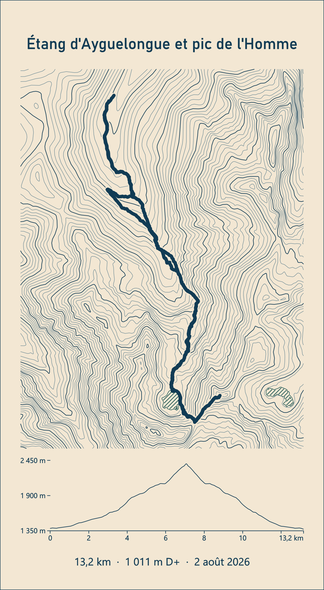
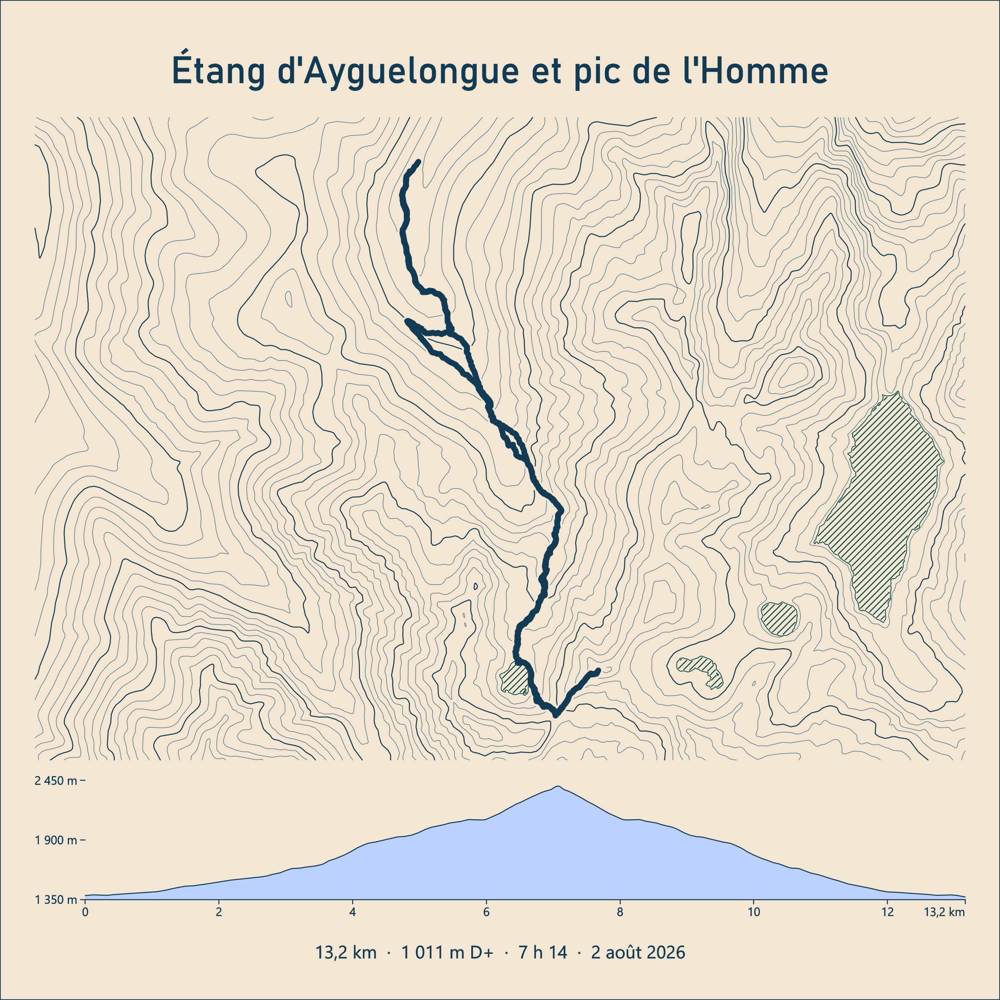
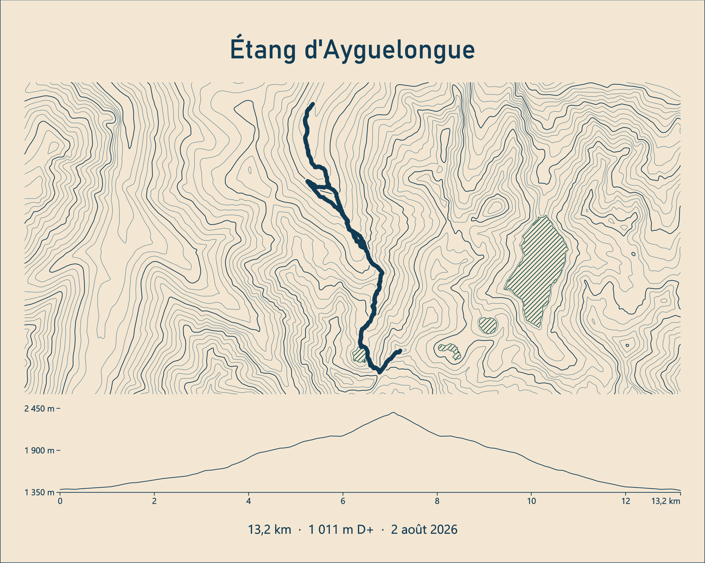

# gpx2engraving

Transforme une trace GPX en **SVG propre, prêt à graver au laser** (LightBurn) :
titre, trace sur courbes de niveau, plans d'eau, profil altimétrique, distance, D+, date.

*Turns a GPX track into a clean, laser-ready SVG (LightBurn): title, track over contour lines,
lakes, elevation profile, distance, elevation gain and date. French IGN data (RGE ALTI 5 m DEM,
BD TOPO water bodies), text converted to paths, millimetre units.*

| Portrait (auto) | Carré | Paysage |
|---|---|---|
|  |  |  |

Les trois planches ci-dessus sortent de la même commande, seule l'option `--format` change.

## Ce que fait le script

1. Lit le GPX (traces ou itinéraires, plusieurs segments acceptés) et le projette en Lambert-93.
2. Calcule la distance, le D+ (altitude lissée + seuil d'hystérésis), la date et la durée.
3. Choisit la forme de la planche (carré, portrait ou paysage) au plus serré autour de la trace, 20 cm maximum.
4. Télécharge le MNT IGN **RGE ALTI 5 m** sur l'emprise (mis en cache), le lisse et génère les courbes de niveau, équidistance automatique.
5. Récupère les plans d'eau IGN **BD TOPO** (ou OpenStreetMap) et les hachure.
6. Nettoie tout pour le laser : découpe au cadre, simplification des tracés, suppression des micro-fragments, halo vide autour de la trace.
7. Vectorise les textes (titre, statistiques, étiquettes) : aucune police n'est nécessaire côté laser.
8. Écrit un SVG en millimètres, un calque par couleur LightBurn, plus un aperçu PNG.

## Prérequis

- **Windows + QGIS** (3.28 ou plus récent). Le script s'exécute avec le Python livré avec QGIS, qui fournit
  déjà GDAL, numpy, shapely, pyproj, scipy, matplotlib et fontTools. Rien d'autre à installer.
- Une connexion internet pour le MNT et les lacs (les téléchargements sont mis en cache dans `cache/`).
- Zone couverte : **France** (données IGN Géoplateforme, gratuites, sans clé).

Sans QGIS, un Python 3.10+ avec `numpy scipy shapely pyproj requests matplotlib fonttools` fonctionne aussi :
`python gpx2engraving.py trace.gpx ...`

## Utilisation

```bat
gpx2engraving.bat trace.gpx --title "Étang d'Ayguelongue et pic de l'Homme"
```

Produit `trace.svg` et `trace_apercu.png` à côté du GPX, et affiche un résumé JSON
(planche, échelle, distance, D+, altitudes, lacs trouvés).

Sans `--title`, le nom de la trace contenu dans le GPX est utilisé.

### Exemples

```bat
:: Planche carrée, durée affichée, aire sous le profil remplie
gpx2engraving.bat trace.gpx -t "Pic de Cagire" --format square --show-duration --profile-fill

:: Paysage, trace en ligne fine plutôt qu'en remplissage, lacs OpenStreetMap
gpx2engraving.bat trace.gpx -t "Lac d'Oô" --format landscape --track-style line --water osm

:: Équidistance forcée à 20 m, planche de 15 cm max, sans date
gpx2engraving.bat trace.gpx -t "Néouvielle" --interval 20 --max-size 150 --no-date

:: Lot : toutes les traces d'un dossier, titre = nom de la trace
for %f in (C:\rando\*.gpx) do gpx2engraving.bat "%f"
```

Une trace d'exemple est fournie : `exemples/ayguelongue.gpx`.

### Options principales

| Option | Défaut | Effet |
|---|---|---|
| `--title`, `-t` | nom GPX | titre gravé |
| `--out`, `-o` | à côté du GPX | fichier SVG de sortie |
| `--format` | `auto` | `auto`, `square`, `portrait`, `landscape` |
| `--max-size` | 200 | côté maximal de la planche (mm) |
| `--margin` | 250 | marge de terrain minimale autour de la trace (m) |
| `--interval` | auto | équidistance des courbes (m) ; auto vise `--target-lines` niveaux (40) |
| `--index-every` | 5 | une courbe maîtresse toutes les N, dans un calque séparé (0 = aucune) |
| `--smooth` | 1.2 | lissage gaussien du MNT (pixels) |
| `--track-width` | 1.1 | largeur gravée de la trace (mm) |
| `--track-style` | `fill` | `fill` (polygone rempli), `line` (axe), `both` |
| `--halo` | 0.45 | vide autour de la trace pour la détacher des courbes (mm) |
| `--water` | `ign` | `ign`, `osm`, `none` |
| `--water-hatch` | 0.9 | espacement des hachures des lacs (mm), 0 = contour seul |
| `--elev-source` | `auto` | altitude du GPX si présente, sinon du MNT ; forcer `gpx` ou `dem` |
| `--dplus-threshold` | 5 | seuil d'hystérésis du D+ (m) |
| `--show-duration` / `--show-moving` | off | ajoute la durée totale / le temps en mouvement |
| `--date` / `--no-date` | date du GPX | date personnalisée (texte libre) ou aucune |
| `--profile-fill` / `--no-profile` | off | aire sous le profil (remplissage) / pas de profil |
| `--corner-radius` / `--no-frame` | 4 | angles arrondis du contour de découpe / pas de contour |
| `--font`, `--title-font` | auto | polices .ttf ou .otf |
| `--no-preview` | off | ne génère pas l'aperçu PNG |

`gpx2engraving.bat --help` liste tout.

### Polices

Le script cherche dans l'ordre Funnel Display, Mulish, Bahnschrift, Segoe UI, Arial, DejaVu.
Déposez vos `.ttf` dans un dossier `fonts/` à côté du script pour qu'ils soient pris en priorité,
ou passez `--title-font` et `--font`.

## Dans LightBurn

Importer le SVG (les dimensions sont en mm, LightBurn les respecte). Une couleur = un calque,
les couleurs sont celles de la palette LightBurn :

| Calque SVG | Couleur | Contenu | Mode conseillé |
|---|---|---|---|
| `frame` | C02 rouge | contour de la planche, angles arrondis | découpe |
| `contours` | C01 bleu | courbes de niveau | ligne, faible puissance |
| `contours_index` | C09 bleu foncé | courbes maîtresses | ligne, puissance un peu plus forte |
| `water` | C06 cyan | contour des lacs | ligne |
| `water_hatch` | C14 bleu clair | hachures des lacs | ligne |
| `track` | C00 noir | trace GPX (polygone) | remplissage |
| `track_line` | C16 gris | axe de la trace (si `--track-style line` ou `both`) | ligne |
| `profile` | C03 vert | courbe du profil, base, graduations | ligne |
| `profile_fill` | C11 vert foncé | aire sous le profil (si `--profile-fill`) | remplissage |
| `text` | C07 magenta | titre, statistiques, étiquettes | remplissage |

Les épaisseurs de trait du SVG n'ont pas d'importance en mode ligne : c'est la largeur du faisceau qui compte.
Pour une trace plus ou moins épaisse, jouer sur `--track-width`.

## Calcul du D+

L'altitude (GPX par défaut) est rééchantillonnée tous les 5 m, lissée sur 60 m (`--elev-smooth`),
puis les montées sont cumulées avec un seuil d'hystérésis de 5 m (`--dplus-threshold`).
Cela évite la surestimation du D+ GPS brut. Pour se caler sur une application donnée, ajuster le seuil
(plus il est haut, plus le D+ baisse). `--elev-source dem` utilise l'altitude du MNT IGN à la place du GPX.

## Sources de données

- MNT : IGN Géoplateforme, WMS-Raster `ELEVATION.ELEVATIONGRIDCOVERAGE.HIGHRES` (RGE ALTI 1 à 5 m).
  `--dem-layer ELEVATION.ELEVATIONGRIDCOVERAGE` bascule sur la BD ALTI 25 m.
- Plans d'eau : IGN Géoplateforme, WFS `BDTOPO_V3:plan_d_eau`, ou Overpass (OpenStreetMap, `natural=water`).

## Limites connues et pistes

- Hors France, seul `--water osm` fonctionne : le MNT reste à brancher sur une source mondiale (Copernicus GLO-30).
- Les segments de courbe parfaitement rectilignes sont des zones planes du MNT (lacs, replats), pas un bug.
- Pas de cours d'eau ni de sommets nommés pour l'instant (données disponibles dans la BD TOPO).

## Licence

MIT. Données IGN sous licence ouverte Etalab 2.0, données OpenStreetMap sous ODbL.
